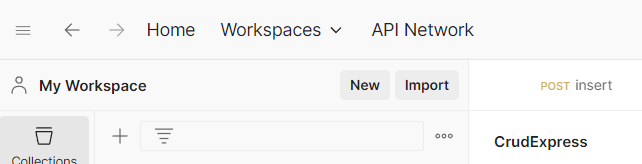

# CRUD express.js dasar full validasi

Creating a simple program using node.js with the framwork express.js, this crud program has sereveral crud features like  Create, read, update and delete
of cource use validation form express namely express validator.

## Author

👤 **Rino sitanggang**  
[GitHub Profile](https://github.com/username/Rinoyy)

## Method functions
**Method pada fungsi:**
| No  | Fungsi  | method |
| --- | ------- | ------ |
| 1   | GetData | GET    |
| 2   | Show    | Get    |
| 3   | Delete  | Delete |
| 4   | update  | post   |

<!--  -->
## how to use ?
I want to share how to run this code on your device from folder creation to final use, Divided into several parts, namely:

- Folder creation and cloning
- Install express package
- Database creation in phpMyAdmin
- Use in Postman

### Creating and Cloning
1. Open cmd or git bash on your divice
2. Before you cloning the respository, you should to make a folder in program file C or other, after you create a folder, open the folder in C: click windows and then search CMD.
3. Enter the command **dir** into your cmd to find whether your folder is created or not.
4. If the folder already exists, you have to **cd your_name_folder**.
5. Since  you are now in the folder where you want to save our proejct, Enter the  command into your cmd **git clone https://github.com/Rinoyy/ExpressCrud.git**.
6. After the cloning is complete, enter this command **code .** to open the project in your vscode.

### Install express.js and packages 
1. Press the shortcut **ctrl + shift + `** to open a new terminal vscode
2. Run  **npm init -y** to node.js initialization
3. Run **npm install express** to install express modules
4. Run **npm install joi** to install Joi validation
5. Run **npm install multer** to install the Multer middleware for handling file uploads.
6. Run **npm install prisma --save-dev** to install global prisma
7. Run **npx prisma init** to initialization

### Creating Database
1. Turn on xampp, laragon or whatever you have
2. Open your browser and enter **http://localhost/phpmyadmin**
3. Create a new database with the name **mydatabase** and press the go button.

### Postman
1. Open Postman on your device. If you don’t have Postman installed, you can download it from here https://www.postman.com/downloads/.
2. Create a folder to store all requests, click the plus icon then press blank collection   
    